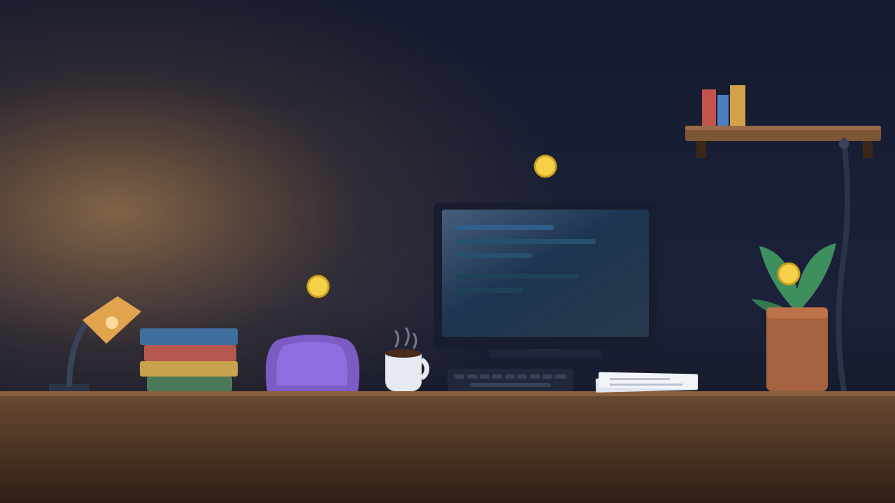

# Visoto

**Your room is the level.**

Photograph anything. Ten seconds later a character is running along your
keyboard, bouncing off your pillow and dodging your coffee — because the coffee
is hot, and the system knows what hot coffee does to you.



---

## The idea: semantic physics

Most "AI makes a game" demos detect rectangles and make them all solid. That
produces a level built from your photo, but not a level built from your *room* —
every object behaves identically, so the photo is wallpaper.

Visoto assigns physics from **what an object is**, not what it looks like:

| Object | Material | Why |
|---|---|---|
| stack of books | solid | dense paper, stacked flat and level |
| cushion | **bouncy** | soft foam, compresses then springs back |
| mug of coffee | **hazard** | ceramic full of scalding liquid |
| monitor | **slippery** | sheet glass, almost frictionless |
| loose paper | **crumbling** | single sheets with nothing beneath them |
| hanging cable | **climbable** | flexible line long enough to haul up |

Every object carries the reason it was classified that way, and the UI shows it
on hover. The reason is not decoration — it is the claim the system is making,
put where you can check it.

Eight materials: solid, bouncy, hazard, climbable, crumbling, slippery,
collectible, tunnel — pipes that drop you into a bonus chamber built from the
same scene (see below).

---

## The hard part: proving the level is playable

A vision model returns *plausible* boxes, not a *playable* level. Boxes overlap,
float, sit on top of each other, or leave the goal stranded across a gap no jump
can cross. Ship that straight to the player and roughly one level in three is
impossible — which is indistinguishable from "the app is broken".

So no level reaches the player until it has been proved completable:

1. **Sanitise** — clamp boxes, drop frame-sized ones, de-duplicate overlaps
2. **Ground** — guarantee a floor so the player cannot spawn into the void
3. **Graph** — model each solid's top edge as a node
4. **Prove** — BFS across the graph using the *actual jump arc* from the physics
   engine, not an approximation of it
5. **Repair** — insert switchback bridge platforms until the goal is reachable

Step 4 is why the tuning constants live in `lib/physics.ts` and are imported by
`lib/solver.ts` rather than copied. The solver reasons about the exact arc the
player will fly; if those two ever drift, the proof becomes fiction.

### What the proof kept getting wrong

Reachability maths alone is not enough, and the completability harness
(`npm run verify`) caught every one of these by refusing to finish a level the
solver had already certified:

- **Ceiling traps.** A jump arc only looks at where you land, never at what is
  directly over your head. A lamp above the route wedged the player permanently:
  they could not walk through the obstacle beside them and could not jump over
  it. Fixed by requiring vertical clearance, not just a landing spot.
- **Spawning inside things.** Headroom asks what is overhead; it says nothing
  about a wall running straight through where the player is about to stand.
- **Vertical shafts.** The repair step itself built them — five bridges stacked
  directly above each other, 63px apart, for a 46px player. A platform must not
  seal the surface below it *and* must not land the player somewhere already
  sealed. Both halves, or staircases collapse into coffins.
- **Towers over empty floors.** When the goal floats high above a bare scene,
  the proof can be satisfied by erecting a tower in mid-air. That is a correct
  answer to the wrong question. The goal is lowered to a height the scene
  actually supports instead.
- **Goals hanging in space.** A goal with nothing under it can only be collected
  by clipping it at the peak of a jump — a precision demand the level never
  advertised. Goals get a landing.
- **Jumps that fly through fire.** Reachability originally checked only
  distance and height between two surfaces — a jump that physically covers the
  gap counted as valid even if the arc passed straight through a hazard. The
  solver now simulates the actual parabola the physics engine would fly and
  rejects any jump a hazard sits inside of, not merely ones that land on one.

Every repair is reported in the UI rather than hidden. If the solver had to
rebuild your level, you get told.

---

## Playing it

| | |
|---|---|
| `←` `→` | move |
| `space` | jump — held longer for a higher arc |
| `↑` | climb anything climbable |
| `esc` / `P` | pause |
| `X` | X-ray |
| `F` | full screen |
| `R` | restart |

Levels open on a Ready screen rather than dropping you in mid-air, pausing
freezes the clock as well as the physics, and settings persist across sessions:
sound, particles, screen shake, and whether object labels stay visible during
play. Particles and shake default to off when the system asks for reduced
motion. Dying opens a retry screen naming what killed you and resets the
clock — the one number that survives a retry on purpose is the fall count,
since a fresh zero would hide how many attempts a level actually took.

Patrolling monsters guard the route Mario-style: touching one from the side
kills you, landing on top stomps it. Walking onto a pipe (no key needed —
arrival alone triggers it) drops you into a bonus chamber built from the same
scene, stuffed with coins and only escapable by climbing back up to a second
pipe. The chamber is hand-authored rather than generated, precisely because it
never passes through the solver's completability proof.

Three built-in scenes ship with the app — a desk, a living room and a washroom —
so it is playable with no key and no photo at all. Each is hand-authored rather
than model-generated, so its geometry is exact, and each is still run through
`solve()` on load like any uploaded photo. They are illustrations, not
photographs, and the UI says so rather than implying the model produced them.

Characters unlock with coins, spent from a ledger that pays each individual
coin exactly once, ever — restarting a level to farm the same coin repeatedly
earns nothing, on purpose.

| Character | Blob | Bean | Spook | Unit | Cat | Slime |
|---|---|---|---|---|---|---|
| Cost (coins) | 0 | 8 | 18 | 32 | 50 | 72 |

Every level carries nine coins plus a two-coin bonus for clearing it, and a
bonus chamber (above) holds twenty-one more. The three built-in scenes alone —
no photo, no key — total 33 coins, enough to unlock the first four characters;
Cat and Slime need coins from a bonus chamber or an uploaded photo, because a
fresh photograph is worth roughly sixteen coins and pointing the camera at
something new is the behaviour worth rewarding.

Six characters — Blob, Bean, Spook, Unit, Cat, Slime — in eight colours, all
drawn procedurally, so no sprite sheets ship and a new character costs one
function. The picker previews each one using the very same `drawCharacter` the
game calls, so a swatch cannot drift from what actually appears on screen.

Every character occupies an identical collision box, and that is a correctness
requirement rather than a shortcut: the solver proves each level completable
using the player's exact width, height and jump arc, so a character that was
taller or wider would silently invalidate every proof the app makes. Skins
change how the player looks and nothing else.

Full screen tries the Fullscreen API first and falls back to filling the
viewport with CSS, so the control still works in embedded contexts where the
API is refused — a dead button is worse than either.

Sound effects are synthesised from oscillators at runtime, so there are no audio
files in the repo. The coin pitch climbs with each one collected in a row, which
is most of what makes collecting them feel good.

## Press X

The X-ray toggle fades the photo and draws the raw collision geometry, labelled.
It exists because "AI generated this playable level" is an easy thing to fake
with a video, and one keypress should be enough to show it isn't.

---

## Export

A level that only runs on this website is a demo. Every level exports to:

- **Visoto JSON** — the native format, documented in `lib/level.ts`
- **Godot 4** `.tscn` — static bodies grouped by material, with label/reason/
  material preserved as node metadata
- **Phaser / Tiled** — an object layer with materials as object properties

Level design is the bottleneck in small-team game development. This turns any
photograph into a starting point, in an engine you already use.

---

## Running it

```bash
npm install
npm run dev
```

The app is fully playable with no configuration — the three built-in scenes
are hand-authored and need no API access. To analyse your own photos, add a
key:

```bash
echo 'GEMINI_API_KEY=...' >> .env.local
```

A key is free from [AI Studio](https://aistudio.google.com/apikey) and needs no
billing account. A photo takes roughly 10–20 seconds end to end, depending on
model load.

The route tries `gemini-3.5-flash`, then `gemini-3.6-flash`, then
`gemini-3.5-flash-lite`, because a demo should not be one capacity spike away
from failing. The whole chain shares a single time budget rather than giving
each attempt its own — a client that gives up before a slow-but-working
request finishes is a worse failure than a slightly longer wait. Override the
primary model with `GEMINI_MODEL`.

Verify that every level is actually completable:

```bash
npm run verify
```

This releases a swarm of bots onto the real physics engine and checks that they
finish. It is the empirical counterweight to the solver's paper proof — when the
two disagree, the bots are right.

---

## How it is built

| | |
|---|---|
| `lib/level.ts` | Level format, the seven materials, and the JSON Schema handed to the model — kept in one file so schema and types cannot drift |
| `lib/physics.ts` | Fixed-timestep AABB platformer. Coyote time, jump buffering, variable jump height |
| `lib/solver.ts` | Validation, the reachability proof, and the repair passes |
| `lib/export.ts` | Godot and Phaser exporters |
| `lib/audio.ts` | Procedural sound effects — oscillators, no asset files |
| `lib/character.ts` | Six player characters, drawn on canvas; identical hitboxes |
| `lib/settings.ts` | Player settings, persisted to localStorage |
| `lib/image.ts` | Client-side 16:9 crop, so normalised boxes map to the world exactly |
| `app/api/analyze` | The one model call: image in, structured level out |
| `scripts/verify.ts` | Completability harness |

Next.js 16, TypeScript, Tailwind, and `gemini-3.5-flash` with a structured-output
schema. No game engine — the physics is about 300 lines, because the solver has
to be able to reason about it exactly.

The model is the most swappable part of the project: exactly one file
(`app/api/analyze/route.ts`) knows which provider is in use, and the other ~2,900
lines do not. The schema is written in Gemini's native spatial conventions —
boxes as `[ymin, xmin, ymax, xmax]` and points as `[y, x]`, normalised to
0-1000 — because that is what the model is trained to emit; asking it to
translate into the engine's own layout produced visibly worse boxes. The
conversion happens once, at the boundary, in `lib/normalise.ts`.

Photos are cropped in your browser, then sent to Google's Gemini API for
analysis. This project's own server never stores them — but they do reach
Google, which is a fact worth stating plainly rather than leaving a reader to
assume "never stored" means "never sent anywhere."
